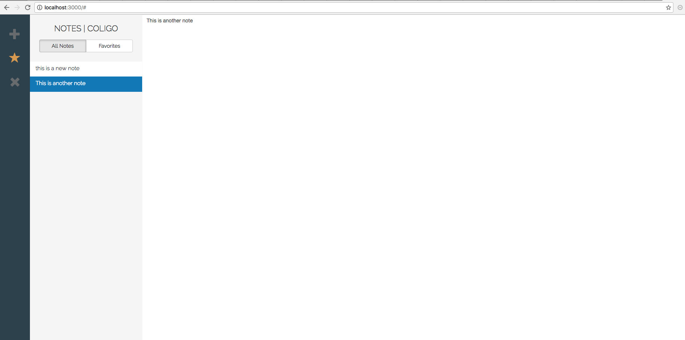

#### 简介

这是我的一个个人Vuex练习项目,项目模仿了Mac上面的Notes软件，主要利用webpack打包而成。

软件界面：



启动方式：到项目根目录下，直接运行

```
npm run start
```

#### 版权说明

这个软件部分内容来自网上的Vuex教程，并不是完全由笔者从0开发，笔者仅仅是本着学习原则将内容重新写过，由于目前将经历放在react相关技术领域，暂时没有更复杂的Vuex项目。

另外，Vuex 2.0之后有了较大改动，技术更新快速，可能这个内容也有些许过时，建议大家进行慎重选择和参考。
